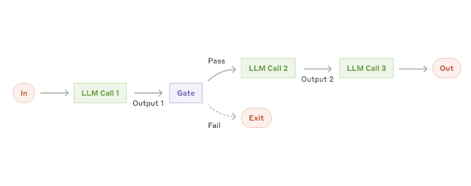
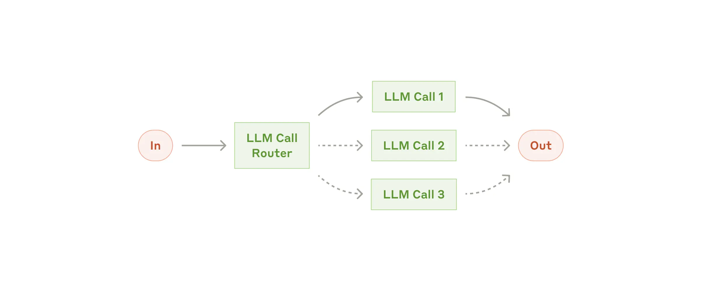

# **Simple AI Agent**

## **🤖AI Agent란?**

AI 에이전트는 사용자나 시스템을 대신해 자율적으로 작업을 수행할 수 있는 단순한 챗봇을 넘어 환경을 인식하고, 의사결정을 내리며, 목표를 달성하기 위한 행동을 취할 수 있는 시스템

AI Agent를 쉽게 구현 하기 위한 많은 프레임 워크가 있음
- LangGraph 
- Amazon Bedrock
- Rivet 
- Crew AI

해당 프로젝트에선 이러한 프레임워크를 사용하지 않고 LLM API 만을 이용하여 다음과 같은 Agent를 구현

### **1. Prompt Chaining**

**복잡한 작업을 여러 단계로 나눠서, 단계마다 LLM을 호출해서 처리하는 방식**

- 작업이 단계적으로 나뉘는 경우

- 각 단계를 정확히 처리하고 싶은 경우

- 품질을 높이고 싶은 경우 

### **2. Routing**

**입력을 분류해서, 그에 맞는 특화된 작업이나 프롬프트로 보내는 방식**

- 목적 태스크에 맞는 LLM으로 전달
- 각 유형에 따라 다른 처리 방법이나 모델이 더 적합한 경우
- 특정 입력만 잘 다루도록 프롬프트를 최적화하고 싶은 경우

### **3. Parallelization**

**하나의 작업을 여러 개의 LLM 호출로 동시에 처리하고, 결과를 모아서 사용하는 방식**

1. Sectioning 
→ 작업을 여러 개의 독립된 하위 작업으로 나눠서 각각 병렬로 처리

예:

한 모델은 사용자 질문에 답하고,
다른 모델은 부적절한 내용이 있는지 필터링

LLM 평가 자동화:
예를 들어 "정확성", "논리성", "창의성"을 각각 따로 평가

2. Voting 
→ 동일한 작업을 여러 번 실행해서 다양한 결과를 받아보고,
그 중에서 가장 적절한 응답을 선택하거나 다수결 투표를 통해 결정

예:

코드를 여러 번 리뷰해서 보안 취약점 찾기

콘텐츠가 부적절한지 판단할 때 여러 관점에서 판단 → 합산하여 결론 도출

**참고**
[Anthropic의 "Building Effective Agents"](https://www.anthropic.com/engineering/building-effective-agents)